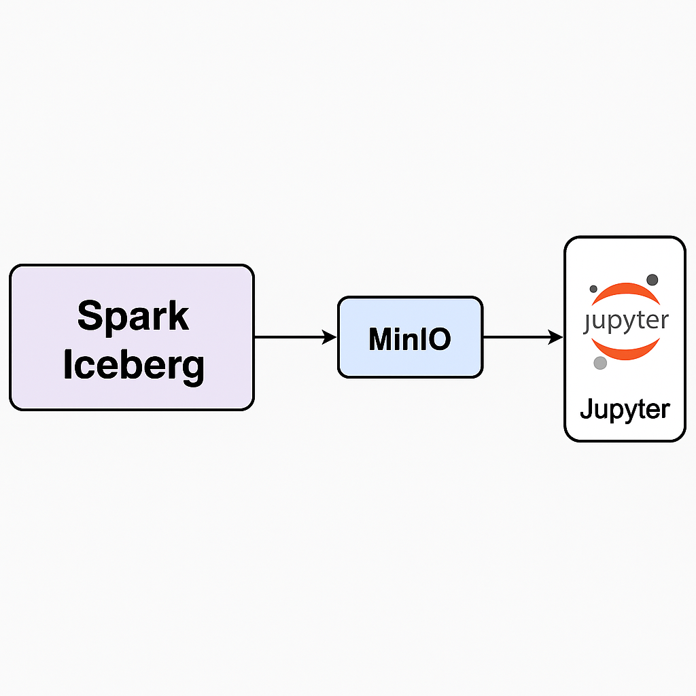

#  Iceberg Minion Spark Local Playground

*A hands-on project to explore Apache Iceberg features with Spark + MinIO + Jupyter*

---

## 1. Why This Project?

Modern analytics workloads require handling **huge datasets** with:

* Frequent **updates, corrections, late-arriving data**
* Evolving **schemas and partitions**
* Support for **time travel** to debug or audit past states
* **High performance** queries with **ACID guarantees** and supporting multiple tools 

This project is a **guided playground** that demonstrates these concepts using **Apache Iceberg**.

---

## 2. Core Database Operations

| Operation  | What it Does                          | Example                                           |
| ---------- | ------------------------------------- | ------------------------------------------------- |
| **INSERT** | Adds new rows                         | `INSERT INTO flights VALUES (...)`                |
| **UPDATE** | Modifies existing rows only           | `UPDATE flights SET ... WHERE flight_id='LH9001'` |
| **UPSERT** | Update if exists, insert if not       | Conceptual shorthand (implemented via MERGE)      |
| **MERGE**  | Full sync: update + insert (+ delete) | `MERGE INTO flights USING corrections ON ...`     |

In Iceberg/Spark, **MERGE** is the correct way to do **upserts**.

---

## 3. Advanced Features

* **Schema Evolution** → Add/remove/rename columns without rewriting full table.
* **Partition Evolution** → Change partitioning strategy (e.g., `day` → `month`) seamlessly.
* **Time Travel** → Query snapshots from the past.
* **ACID Transactions** → Reliable concurrent reads/writes.
* **High Performance** → Pruning + metadata layers for massive scale.

---

## 4. Delta vs. Iceberg

Both **Delta Lake** and **Apache Iceberg** are table formats built on open data lakes.

| Feature             | Delta Lake                             | Apache Iceberg                               |
| ------------------- | -------------------------------------- | -------------------------------------------- |
| Maturity            | Backed by Databricks, strong ecosystem | Broad adoption (Netflix, Apple, Adobe, etc.) |
| Transactions        | ACID                                   | ACID                                         |
| Schema Evolution    | Supported                              | Supported (very flexible)                    |
| Partition Evolution | Limited                                | Fully supported                              |
| Engine Support      | Spark (best), some Presto/Trino        | Spark, Trino, Flink, Presto, Hive, Snowflake |
| Governance          | Databricks-driven                      | Apache Foundation (open governance)          |

**Use Delta Lake** if you are primarily in a Databricks ecosystem.
**Use Iceberg** if you need broad engine compatibility + advanced partition evolution.

---

## 5. Project Structure

```
.
├── docker-compose.yml        # Infra setup (Spark, MinIO, Jupyter)
├── Makefile                  # Automated demo steps
├── scripts/                  # SQL + PySpark steps
│   ├── step1_create_insert.sql
│   ├── step2_partition_evolve.sql
│   ├── step3_merge_upsert.sql
│   ├── step4_time_travel.py
│   ├── step5_schema_evolution.sql
├── notebooks/
│   └── iceberg_quickstart.ipynb   # Interactive walkthrough
├── README.md
```

---

## 6. Why MinIO?

We use **MinIO** as a local, S3-compatible object store → it simulates cloud storage (AWS S3) but runs locally in Docker.
Iceberg tables are stored as **metadata + Parquet files in MinIO buckets**.

---

## 7. How to Run

###  Quickstart

1. **Clone & start infra**

```bash
git clone https://github.com/ankit-khare-2015/iceberg-minio-spark-playground.git
cd git clone https://github.com/ankit-khare-2015/iceberg-minio-spark-playground.git
make up 
```

`make up` will set up everything you need: all Docker images, containers (Spark, MinIO,Jupyter and notebooks), and buckets.

```bash
make demo 
```
This will run steps:

* Step 1 → Create + Insert
* Step 2 → Partition evolution
* Step 3 → MERGE upsert
* Step 4 → Time travel
* Step 5 → Schema evolution

SQL outputs are shown **cleanly in terminal**.


1. Base Table Schema (local.airline.flights)

| Column             | Type      | Description                               |
| ------------------ | --------- | ----------------------------------------- |
| `flight_id`        | STRING    | Unique flight identifier (e.g., `LH9001`) |
| `origin`           | STRING    | Departure airport code (e.g., `FRA`)      |
| `dest`             | STRING    | Destination airport code (e.g., `LHR`)    |
| `scheduled_dep_ts` | TIMESTAMP | Scheduled departure time                  |
| `actual_dep_ts`    | TIMESTAMP | Actual departure time (nullable)          |

2. Sample Data

| flight\_id | origin | dest | scheduled\_dep\_ts  | actual\_dep\_ts     |
| ---------- | ------ | ---- | ------------------- | ------------------- |
| LH9001     | FRA    | LHR  | 2025-01-01 10:00:00 | 2025-01-01 10:05:00 |
| LH9002     | FRA    | JFK  | 2025-01-01 12:00:00 | 2025-01-01 12:10:00 |
| LH9003     | MUC    | SIN  | 2025-01-02 08:00:00 | NULL                |


3. **Interactive playground (Jupyter)**

Use Jupyter notebook 

Then open: [http://localhost:8888](http://localhost:8888)

Run the **`iceberg_quickstart.ipynb`** notebook → experiment with queries + see effects after each step.

---

## 🔹 8. Iceberg Quickstart Notebook

The notebook provides:

* Queries for each step (INSERT, MERGE, Time Travel, Schema Evolution)
* Outputs to highlight *what changed*
* Run all steps in sequence
* Try your own queries


---

##  9. Learning Goals

1. After completing this project, you’ll:
2. Understand difference between **UPDATE, UPSERT, MERGE**
3. See **schema + partition evolution in action**
4. Use **time travel** for data debugging
5. Understand why Iceberg is becoming a **standard for data lakes**
6. Be able to replicate & extend this demo into your own projects

---

## 10. References

* [Apache Iceberg Docs](https://iceberg.apache.org/docs/latest/)
* [Delta Lake vs Iceberg](https://delta.io/)
* [MinIO Project](https://min.io/)
* [Spark SQL Iceberg Extension](https://spark.apache.org/docs/latest/sql-programming-guide.html)

---
